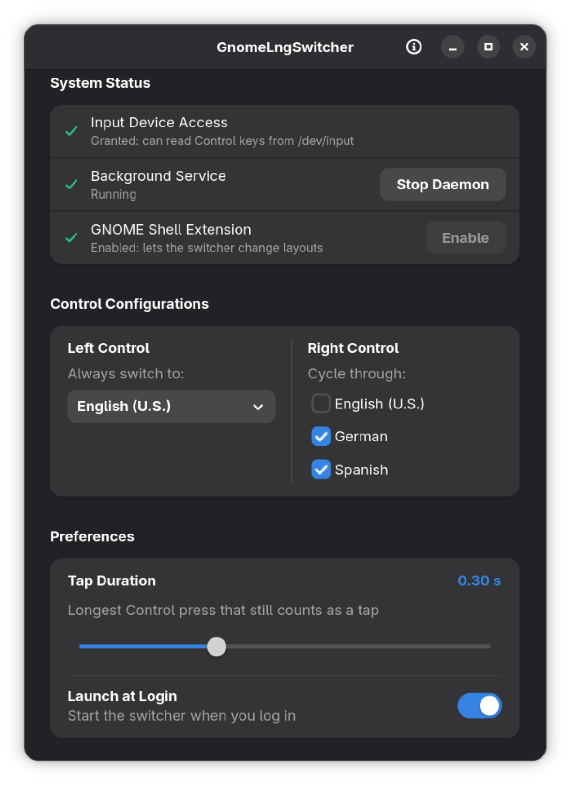

# GnomeLngSwitcher

Control-key keyboard layout switching for **GNOME** (Wayland and X11).

* Tap **Left Control**: switch straight to your main layout (e.g. English).
* Tap **Right Control**: cycle through the layouts you choose (e.g. German, Spanish, Ukrainian).
* Normal shortcuts (`Ctrl+C`, `Ctrl+Alt+T`, holding Control) never trigger a switch.

It consists of a small background daemon that reads key events from `/dev/input`, a native GTK4/Libadwaita settings window, and a tiny GNOME Shell extension that performs the actual layout change.



Website: <https://oleksiym.github.io/GnomeLngSwitcher/>

---

## Requirements

* GNOME Shell 45 – 50 (the extension is declared for these versions)
* `x86_64` or `aarch64` Linux, with GTK 4 and libadwaita runtime libraries (present on any current GNOME desktop)
* `curl`, `tar`, `sha256sum` for the installer (present on virtually every system)
* Your user must be in the `input` group (see [First run](#first-run))

Built and tested on **Fedora 44**.

## Install / update

```bash
curl -fsSL https://raw.githubusercontent.com/OleksiyM/GnomeLngSwitcher/main/install.sh | bash
```

The installer works from a release archive and never installs anything outside your home directory (no `sudo`):

1. Downloads `gnome-lng-switcher-<version>-<arch>.tar.gz` and `SHA256SUMS` from the latest GitHub release.
2. Verifies the SHA-256 checksum. If the [GitHub CLI](https://cli.github.com/) (`gh`) is installed, it also verifies the signed build provenance (Sigstore attestation) of the archive.
3. Installs the binary and `uninstall.sh` to `~/Applications/GnomeLngSwitcher/`, the extension to `~/.local/share/gnome-shell/extensions/gnome-lng-switcher@oleksiym.github.io/`, and an application launcher.
4. Restarts the daemon.

Options (download the script first to use them):

```bash
curl -fsSLO https://raw.githubusercontent.com/OleksiyM/GnomeLngSwitcher/main/install.sh
bash install.sh --version v1.0.0          # install a specific release
bash install.sh --require-provenance      # fail unless the signed provenance could be verified
```

The install location can be changed with `GNOME_LNG_SWITCHER_APP_DIR`.

### Manual install from the archive

```bash
VERSION=1.0.0; ARCH=$(uname -m)     # x86_64 or aarch64
BASE=https://github.com/OleksiyM/GnomeLngSwitcher/releases/download/v$VERSION
curl -fLO $BASE/gnome-lng-switcher-$VERSION-$ARCH.tar.gz
curl -fLO $BASE/SHA256SUMS
sha256sum --check --ignore-missing SHA256SUMS
# optional, with the GitHub CLI:
gh attestation verify gnome-lng-switcher-$VERSION-$ARCH.tar.gz --repo OleksiyM/GnomeLngSwitcher
tar -xzf gnome-lng-switcher-$VERSION-$ARCH.tar.gz
```

The archive contains the binary, the extension (`extension/`), the launcher template (`data/`) and `uninstall.sh`. Running `install.sh` is the supported way to place them.

## First run

1. **Input group.** To read the Control keys without root, add yourself to the `input` group and log out and back in:
   ```bash
   sudo usermod -aG input $USER
   ```
2. **Shell extension.** After the first install, log out and back in once so GNOME Shell discovers the new extension, then enable it:
   ```bash
   gnome-extensions enable gnome-lng-switcher@oleksiym.github.io
   ```
   (or switch it on in the **Extensions** app).
3. Open **GnomeLngSwitcher** from the application grid. All three rows under **System Status** should show a green check.
4. Choose the layout for **Left Control** and the layouts to cycle with **Right Control**, and adjust **Tap Duration** if needed. Changes are saved immediately.
5. Optionally turn on **Launch at Login**.

Closing the window does not stop the daemon. Use **Stop Daemon** to stop it.

The **Settings** button of the extension (Extensions app → *GnomeLngSwitcher*) opens the same application window. The **About** window (ⓘ in the header bar) checks GitHub for a newer release.

## Uninstall

```bash
bash ~/Applications/GnomeLngSwitcher/uninstall.sh          # keeps your settings
bash ~/Applications/GnomeLngSwitcher/uninstall.sh --purge  # also removes ~/.config/gnome-lng-switcher
```

Log out and back in afterwards to unload the cached extension code.

## Running the daemon from a terminal

The GUI and the installer start the daemon detached from the terminal. To run it by hand:

```bash
~/Applications/GnomeLngSwitcher/gnome-lng-switcher --daemon >/dev/null 2>&1 & disown
```

## Configuration

Settings live in `~/.config/gnome-lng-switcher/config.json`. Besides the options in the GUI you can set the settings window size, which is useful with fractional scaling or HiDPI:

```json
{
  "left_ctrl_layout": 0,
  "right_ctrl_layouts": [1, 2],
  "sensitivity_ms": 300,
  "window_width": 540,
  "window_height": 780
}
```

`window_width` / `window_height` are optional (defaults: 540 × 780).

## Building from source

Fedora:

```bash
sudo dnf install -y cargo rust gtk4-devel libadwaita-devel openssl-devel pkgconf gcc
cargo build --release --locked
./scripts/build-package.sh      # builds dist/gnome-lng-switcher-<version>-<arch>.tar.gz
```

Ubuntu / Debian: `sudo apt install -y cargo libgtk-4-dev libadwaita-1-dev libssl-dev pkg-config build-essential`.

## Releases

Releases are produced by GitHub Actions when a `vX.Y.Z` tag is pushed ([release.yml](.github/workflows/release.yml)). The tag must match the version in `Cargo.toml` and `extension/metadata.json` (`./scripts/check-version.sh vX.Y.Z` verifies this). Archives are built inside a `fedora:44` container for `x86_64` and `aarch64`, attested with Sigstore build provenance, and published with a signed `SHA256SUMS`.

## License

[MIT](LICENSE)
